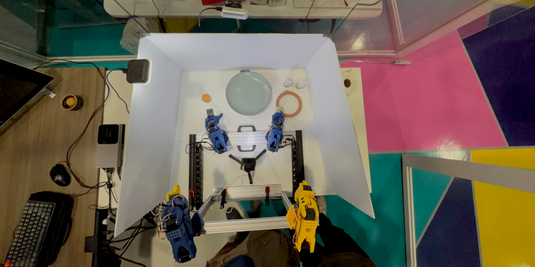

# 🍽️ LePaniPuri: Bimanual Embodied AI for Making Indian Steet Food

LePaniPuri is our Embodied AI Hackathon project, built around teaching bimanual SO-101 arms powered by Jetson Thor and the Groot N1.5 model to make [**Pani Puri**](https://en.wikipedia.org/wiki/Panipuri) - an iconic Indian street food.



This project demonstrates embodied AI applied to a culturally rich manipulation task — preparing pani puri using two coordinated SO-101 arms. Both arms perform following task with coordication:
1. Picking and placing puris
2. Poking holes into the puris
3. Stuffing potato fillings
4. Pouring flavored water through squeeze bottles


## TODO:

- [ ] Release Sphinx Documentation
- [ ] Release Thor Docker for LePaniPuri
- [ ] Release dataset on Hugging Face
- [ ] Release Brev training workflow


## Table of Contents

1. [Key Features](#key-features)
2. [Prerequisites](#prerequisites)
   - [Thor Setup](#thor-setup)
   - [Docker Compose Setup](#docker-compose-setup)
3. [LePaniPuri Repo Setup]()
4. [Troubleshooting](#troubleshooting)
5. [Support](#support)
6. [License](#license)
7. [Acknowledgement](#acknowledgement)


## Key Features

- **Bimanual robot setup** using two pair of SO-101 arms (leader + follower)
- **Jetson Thor deployment** with Docker-based reproducible environments


## Prerequisites

> [!TIP] 
> have the same JetPack version and other dependencies are taken care by the docker:
> | Dependency              | Version |
> |-------------------------|---------|
> | JetPack                 | 7       |
> | L4T                     | 38.2    |
> | Docker                  | 27.5.1  |
> | Docker Compose          | 2.37.1  |
> | NVIDIA Container Tookit | 1.18.0  |
> | Python                  | 3.12.3  |
> | CUDA                    | 13.0    |
> | PyTorch                 | 2.8.0   |


### Thor Setup

> [!NOTE]
> Refer [Official Jetson Thor Setup](https://docs.nvidia.com/jetson/agx-thor-devkit/user-guide/latest/quick_start.html) for latest documentation.

- Flash Jetson Thor with JetPack 7.0 (L4T 38.2) using insturctions [here](https://docs.nvidia.com/jetson/agx-thor-devkit/user-guide/latest/quick_start.html)

- After flashing JetPack 7.0 , install the whole JetPack component software/SDK on the jetson:
  ```
  sudo apt update
  sudo apt install nvidia-jetpack
  ```

- Make sure the Docker daemon configuration file is as follow:
  ```bash
  sudo apt install -y jq
  sudo jq '. + {"default-runtime": "nvidia"}' /etc/docker/daemon.json | \
    sudo tee /etc/docker/daemon.json.tmp && \
    sudo mv /etc/docker/daemon.json.tmp /etc/docker/daemon.json
  ```

- Make sure the ```/etc/docker/daemon.json``` file looks like following:
  ```bash
  {
    "runtimes": {
        "nvidia": {
        "args": [],
        "path": "nvidia-container-runtime"
        }
    },
    "default-runtime": "nvidia"
  } 
  ```

- Add your username to the docker group:
  ```bash
  sudo usermod -aG docker $USER
  newgrp docker
  ```
  > [!NOTE]
  > You may need to restart your terminal/session to apply the changes.

### Docker Compose Setup

- On Jetson Thor, **Docker Compose v2** is to be installed which is distributed through Ubuntu'2 official **apt repository**:
  ```bash
  sudo apt install docker-compose-v2
  ```


## Getting Started

For the latest documentation, see [Sphinx Book Theme Template](https://github.com/trushant05/sphinx_book_theme_template). 


## Troubleshooting

Please refer to:
- [FAQ]()
- [Troubleshoting]()
- [Known Issues]()


## Support

[Github Issues](https://github.com/robo-trail/lepanipuri/issues) should only be used to track executable pieces of work with a definite scope and a clear deliverable. These can be fixing bugs, documentation issues, new features, or general updates.


## ⚖️ License

All licenses for dependencies and assets are located in the ['docs/licenses'](docs/licenses) directory.


## 🙌 Acknowledgement

LePaniPuri was developed during the Embodied AI Hackathon 2025 organized by Seeed Studio and powered by NVIDIA Jetson Thor. Special thanks to the SO-101 arm creators, Isaac Groot team, Hugging Face team for LeRobot and the broader open-source community for their support.

```bibtex
@misc{LePaniPuri,
    author = {Trushant Adeshara, },
    title = {LePaniPuri: Bimanual Embodied AI for Pani Puri (Indian Street Food)},
    month = {October},
    year = {2025},
    url = {https://github.com/robo-trail/lepanipuri}
}
```